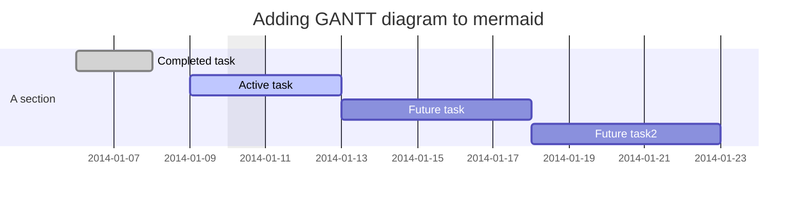
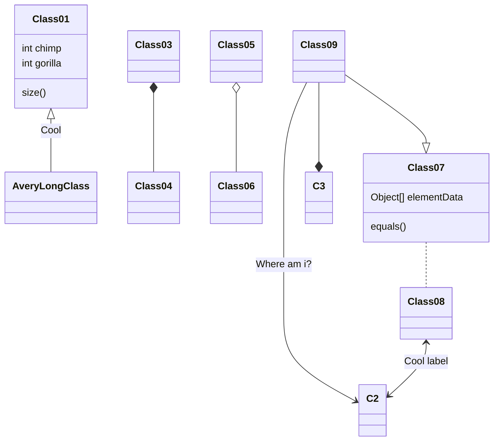

# Creating Diagrams

https://docs.github.com/en/get-started/writing-on-github/working-with-advanced-formatting/creating-diagrams

PlumUML va en Gitlab
https://docs.gitlab.com/ee/administration/integration/plantuml.html
https://plantuml.com/es/

## Creating Mermaid diagrams

https://mermaid.js.org/intro/

Mermaid is a Markdown-inspired tool that renders text into diagrams. For example, Mermaid can render flow charts, sequence diagrams, pie charts and more. For more information, see the Mermaid documentation.

To create a Mermaid diagram, add Mermaid syntax inside a fenced code block with the mermaid language identifier. For more information about creating code blocks, see "Creating and highlighting code blocks."

# Gantt diagram

# Class diagram

For example, you can create a flow chart by specifying values and arrows.

Here is a simple flow chart:

